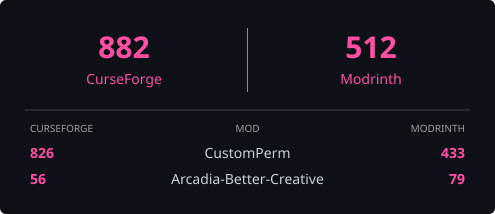

## About

I'm a self-taught independent developer. I mostly write Java, and I pick up other languages when a project needs them.
Most of my work goes into NeoForge Minecraft mods, both server-side and client-side, for [Team-Arcadia](https://github.com/Team-Arcadia), the team behind the Arcadia: Echoes of Power modpack.

## Projects

<table>
  <tr>
    <td width="36%">🛡️ <a href="https://github.com/Team-Arcadia/CustomPerm"><b>CustomPerm</b></a></td>
    <td>Granular permissions for NeoForge: give vanilla and modded commands to non-op players.</td>
  </tr>
  <tr>
    <td>🎨 <a href="https://github.com/Team-Arcadia/Arcadia-Creative-Admin"><b>Arcadia-Creative-Admin</b></a></td>
    <td>Server-enforced creative mode rules, with named profiles defining what players may take.</td>
  </tr>
  <tr>
    <td>🧰 <b>Arcadia-Better-Creative</b> (private)</td>
    <td>Quality-of-life improvements for the creative inventory.</td>
  </tr>
</table>

## Tech stack

  
  
  
  
  
  

## Downloads

  

## Activity

  

---

## À propos

Je suis développeur indépendant et autodidacte. J'écris surtout du Java, et j'apprends d'autres langages quand un projet le demande.
L'essentiel de mon travail, ce sont des mods Minecraft NeoForge, côté serveur comme côté client, pour [Team-Arcadia](https://github.com/Team-Arcadia), l'équipe derrière le modpack Arcadia: Echoes of Power.

## Projets

<table>
  <tr>
    <td width="36%">🛡️ <a href="https://github.com/Team-Arcadia/CustomPerm"><b>CustomPerm</b></a></td>
    <td>Permissions fines pour NeoForge : donner des commandes vanilla et moddées aux joueurs non-op.</td>
  </tr>
  <tr>
    <td>🎨 <a href="https://github.com/Team-Arcadia/Arcadia-Creative-Admin"><b>Arcadia-Creative-Admin</b></a></td>
    <td>Règles du mode créatif imposées côté serveur, avec des profils nommés qui définissent ce que les joueurs peuvent prendre.</td>
  </tr>
  <tr>
    <td>🧰 <b>Arcadia-Better-Creative</b> (privé)</td>
    <td>Améliorations de confort pour l'inventaire créatif.</td>
  </tr>
</table>

---

